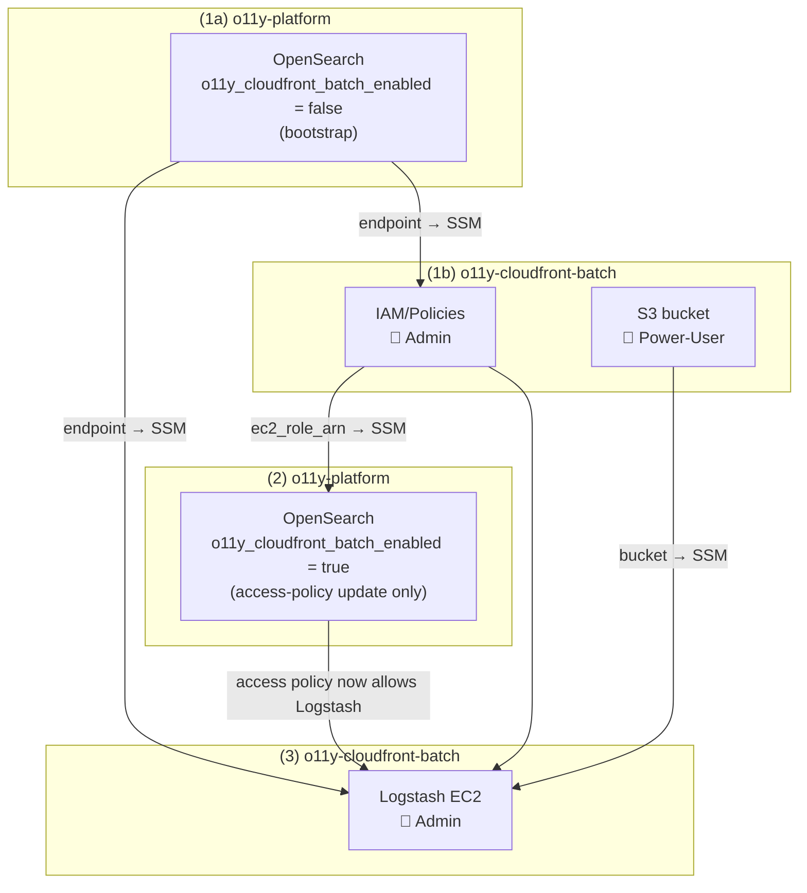

# o11y-cloudfront-batch — Terraform

Deploys the infrastructure for the PDS Web Analytics pipeline:

- **S3 bucket** — log storage (versioning suspended), SSE, and Intelligent-Tiering
- **IAM policy** — grants the Logstash EC2 role read access to S3 and write access to OpenSearch
- **Logstash EC2** — Amazon Linux 2023 instance running Logstash directly via RPM + systemd

> **OpenSearch** is managed separately in [o11y-platform](https://github.com/NASA-PDS/o11y-platform). Deploy it first — the endpoint is published to SSM and consumed automatically here. Its `opensearch` module bootstraps with `o11y_cloudfront_batch_enabled = false`, so Logstash's role isn't actually allowed to write to OpenSearch until someone flips that flag and re-applies it *after* this repo's `iam:deploy` has run — see Step 2 below and o11y-platform's `terraform/README.md#deployment-flow`.

```
terraform/
  ├── iam/policies/         # IAM policy + role attachment  — 🔐 admin (iam:CreatePolicy, iam:AttachRolePolicy)
  ├── s3/                   # S3 log bucket
  └── logstash/             # Logstash EC2                   — 🔐 admin (iam:PassRole)
```

---

## Deployment flow



1. **(1a) Deploy OpenSearch** — See [o11y-platform](https://github.com/NASA-PDS/o11y-platform) (~15-20 min), bootstrapped with `o11y_cloudfront_batch_enabled = false` (and `o11y_cloudfront_streaming_enabled` set however o11y-cloudfront-streaming's status warrants — the two are independent)
2. **(1b) While OpenSearch provisions**, can be run in parallel with (1a):
   - `task iam:deploy VENUE=dev` 🔐 — requires `iam:CreatePolicy`, `iam:AttachRolePolicy`; publishes `ec2_role_arn` to SSM
   - `task s3:deploy VENUE=dev` — creates the log bucket, publishes name to SSM
3. **(2) After `iam:deploy` completes**, back in [o11y-platform](https://github.com/NASA-PDS/o11y-platform): set `o11y_cloudfront_batch_enabled = true` and re-run `task opensearch:deploy` — this only updates the OpenSearch access policy (adds the Logstash role as a principal), no domain redeployment. Skip this if it's already `true` from a prior deploy.
4. **(3) After all above complete** — `task logstash:deploy VENUE=dev` 🔐 — requires `iam:PassRole`; reads OpenSearch endpoint and bucket name from SSM at plan time. **Note:** the EC2 role won't actually be able to write to OpenSearch until step (2) has run — `terraform apply` here will succeed either way, but Logstash will get 403s from OpenSearch until then.

---

## Prerequisites

- [Terragrunt](https://terragrunt.gruntwork.io/docs/getting-started/install/) >= 0.55
- [Task](https://taskfile.dev) — `brew install go-task/tap/go-task`
- AWS CLI + [Session Manager plugin](https://docs.aws.amazon.com/systems-manager/latest/userguide/session-manager-working-with-install-plugin.html) — `brew install --cask session-manager-plugin`
- A local checkout of `cds-infra-deploy` — all Terragrunt inputs live in `venues/<venue>/o11y-cloudfront-batch/`
- AWS credentials exported:
  ```bash
  eval $(aws configure export-credentials --profile <your-profile> --format env)
  unset AWS_PROFILE  # required for Terraform S3 backend compatibility
  ```

---

## Deployment — step by step

All commands run from the `cds-infra-deploy` checkout. See [o11y-platform terraform/README.md](https://github.com/NASA-PDS/o11y-platform/blob/main/terraform/README.md) for the full cross-repo deployment flow; the steps below are the o11y-cloudfront-batch subset.

### Step 0: OpenSearch domain — o11y-platform repo

```bash
task plan  VENUE=dev COMPONENT=o11y-platform/opensearch
task apply VENUE=dev COMPONENT=o11y-platform/opensearch
```

Bootstrapped with `o11y_cloudfront_batch_enabled = false`. Publishes endpoint, ARN, and SG ID to SSM.

---

### 🔐 Step 1: IAM policy — Admin (`iam:CreatePolicy`, `iam:AttachRolePolicy`)

```bash
task plan  VENUE=dev COMPONENT=o11y-cloudfront-batch/iam/policies
task apply VENUE=dev COMPONENT=o11y-cloudfront-batch/iam/policies
```

Publishes `/pds/o11y-cloudfront-batch/iam/ec2_role_arn` to SSM.

---

### Step 2: S3 bucket — 👤 Power User

```bash
task plan  VENUE=dev COMPONENT=o11y-cloudfront-batch/s3
task apply VENUE=dev COMPONENT=o11y-cloudfront-batch/s3
```

---

### Step 2.5: Grant OpenSearch access — o11y-platform repo

Set `o11y_cloudfront_batch_enabled = true` in `venues/<venue>/o11y-platform/opensearch/terragrunt.hcl` and re-apply. Access-policy update only — seconds, not minutes. Skip if already `true`.

```bash
task plan  VENUE=dev COMPONENT=o11y-platform/opensearch
task apply VENUE=dev COMPONENT=o11y-platform/opensearch
```

---

### 🔑 Step 3: Logstash EC2 — Platform Engineer (`iam:PassRole`)

```bash
task plan  VENUE=dev COMPONENT=o11y-cloudfront-batch/logstash
task apply VENUE=dev COMPONENT=o11y-cloudfront-batch/logstash
```

**Logstash will get 403s from OpenSearch if Step 2.5 hasn't run yet** — `apply` succeeds either way, but OpenSearch access requires the access policy update first.

> EC2 creation is optional (`manage_ec2_instance`, default `true`). Prod typically reuses an existing EC2 — set `manage_ec2_instance = false` and `existing_instance_id` in the venue's `terragrunt.hcl`. This step then only manages the SSM Run-As session document and publishes SSM parameters. See [`terraform/logstash/README.md`](logstash/README.md#using-an-existing-ec2-manage_ec2_instance--false) for manual Logstash install steps.

---

### Step 4: Initialize Logstash on the EC2

Userdata only installs the SSM agent — it does **not** run bootstrap or
deploy automatically, on new EC2s or otherwise. Every instance (a fresh
one, or an already-running one after recreating the OpenSearch domain or
fixing a bad env file) needs this run manually:

```bash
# SSM into the EC2 — this lands as root regardless of the Run-As document
# unless your IAM identity has ssm:StartSession on that document's ARN, so
# don't count on landing as pdsops automatically:
aws ssm start-session \
  --target $(aws ssm get-parameter \
    --name /pds/o11y-cloudfront-batch/ec2/logstash_instance_id \
    --query Parameter.Value --output text)

# First time only (root, one-time): install Logstash + configure the
# pdsops key-user. Skip if this has already been run on this instance.
# Repo-independent — download it directly from GitHub:
curl -fsSL -o logstash-bootstrap.sh https://raw.githubusercontent.com/NASA-PDS/o11y-cloudfront-batch/main/scripts/logstash-bootstrap.sh

sudo LOGSTASH_VERSION=8.18.0 bash logstash-bootstrap.sh

# Switch to pdsops before doing anything else — no sudo from here on:
sudo runuser -l pdsops

# Verify what's currently in the env file, if this isn't the first deploy
cat /etc/logstash/env

# Deploy config and start the service. Piped directly from GitHub — no
# prior repo checkout needed; the script clones/updates its own working
# copy to REPO_DIR (default /opt/o11y-cloudfront-batch).
# S3_BUCKET_NAME and OPENSEARCH_ENDPOINT are fetched from SSM automatically.
# S3_CF_BUCKET_NAME must be set explicitly (not in SSM) — use "" if this
# venue doesn't use EN's CloudFront input.
export S3_CF_BUCKET_NAME=<cf-logs-bucket-name>
bash <(curl -fsSL https://raw.githubusercontent.com/NASA-PDS/o11y-cloudfront-batch/refs/heads/main/scripts/logstash-deploy.sh)

# To deploy from a non-main branch (e.g. during active development):
export REPO_BRANCH=<your-branch>
export S3_CF_BUCKET_NAME=<cf-logs-bucket-name>
bash <(curl -fsSL https://raw.githubusercontent.com/NASA-PDS/o11y-cloudfront-batch/refs/heads/${REPO_BRANCH}/scripts/logstash-deploy.sh)
```

> `logstash-deploy.sh` must run as `pdsops`, never root — it checks and
> refuses to run as root. If Logstash itself isn't installed yet, it will
> also refuse and tell you to run `logstash-bootstrap.sh` first — that's
> the only step in this whole workflow that ever needs sudo, and it's rare
> (install/upgrade only).

The deploy script will:
1. Clone/update the o11y-cloudfront-batch repo to `/opt/o11y-cloudfront-batch` (owned by `pdsops`)
2. Copy Logstash pipeline config to `/etc/logstash`
3. Build `pipelines.yml` and `pipelines/*.conf` from templates
4. Apply the OpenSearch ECS index template to the new domain
5. Write `/etc/logstash/env` with the current OpenSearch endpoint from SSM
6. Restart the Logstash `systemd --user` service

> **Sincedb (S3 read position):** Each S3 input has a named sincedb file in `/var/lib/logstash/plugins/inputs/s3/` that tracks which objects have been read. Files are named after the input ID (e.g., `sincedb_file_input_naif1`).
>
> Reset all nodes to re-ingest everything from scratch:
> ```bash
> systemctl --user stop logstash
> rm -f /var/lib/logstash/plugins/inputs/s3/sincedb_*
> systemctl --user start logstash
> ```
>
> Reset a single node (e.g., NAIF only):
> ```bash
> systemctl --user stop logstash
> rm -f /var/lib/logstash/plugins/inputs/s3/sincedb_file_input_naif*
> systemctl --user start logstash
> ```
>
> Leave sincedb intact if you only want to process new S3 objects going forward.

**Tail logs and verify startup:**
```bash
# journalctl requires adm/wheel group membership the pdsops user doesn't
# have — use the log file directly instead:
tail -f /var/log/logstash/logstash-plain.log
```

A healthy startup looks like this (in order):
```
Starting Logstash ...
Log4j configuration path used is: /etc/logstash/log4j2.properties
Pipelines running {:count=>8, :running_pipelines=>[:atm, :en, :geo, ...]}
```

> **Each S3 input polls on a 2-hour interval** (`interval => 7200` in every
> `config/logstash/config/inputs/*.conf`), not continuously — a file
> uploaded to S3 can sit unprocessed for up to ~2 hours until the next poll.
> `systemctl --user restart logstash` forces an immediate poll if you don't
> want to wait. Also double-check the object landed under the right node's
> `prefix` (e.g. NAIF is `naif/naif-httpdlogs` and `naif/naif-xferlogs`,
> not the bucket root) — wrong prefix means that input never sees it.

Once it polls, you should see it pick up the file:
```
[logstash.inputs.s3] Providing file ... {:key=>"path/to/logfile.gz"}
```

**Real-time throughput** — Logstash exposes a monitoring API on
`localhost:9600` by default. This is the most direct way to see whether a
pipeline is actively processing right now:
```bash
# Per-pipeline in/out event counts, queue depth, worker/duration stats
curl -s http://localhost:9600/_node/stats/pipelines?pretty | less

# Just one pipeline (e.g. naif)
curl -s http://localhost:9600/_node/stats/pipelines/naif?pretty
```
Run it twice a few seconds apart and watch `events.in` / `events.out`
increase — if they're moving, it's actively working. `queue.events_count`
climbing with `events.out` flat usually means it's stuck (e.g. blocked on
the OpenSearch output).

To confirm events are landing in OpenSearch, run a quick count from the EC2
(all nodes share one monthly index, `${INDEX_PREFIX}-YYYY-MM`):
```bash
eval $(aws configure export-credentials --format env)
ENDPOINT=$(aws ssm get-parameter --name /pds/o11y-platform/opensearch/opensearch_endpoint \
  --region us-west-2 --query Parameter.Value --output text)

curl -s -X GET "https://${ENDPOINT}/pds-*/_count" \
  --aws-sigv4 "aws:amz:us-west-2:es" \
  --user "${AWS_ACCESS_KEY_ID}:${AWS_SECRET_ACCESS_KEY}" \
  -H "x-amz-security-token: ${AWS_SESSION_TOKEN}" | python3 -m json.tool
```

To check a specific uploaded file, search by its S3 key instead of just counting:
```bash
curl -s --aws-sigv4 "aws:amz:us-west-2:es" \
  --user "${AWS_ACCESS_KEY_ID}:${AWS_SECRET_ACCESS_KEY}" \
  -H "x-amz-security-token: ${AWS_SESSION_TOKEN}" \
  "https://${ENDPOINT}/${INDEX_PREFIX}-$(date +%Y-%m)/_search?q=object.key:*your-file-name*&pretty"
```

**Bad logs / parse failures** — anything tagged `bad_log`,
`_grok_parse_failure`, `_datetimeparsefailure`, `_invalid_http_method`,
`_template_variable`, or `_missing_url_original` is routed to a file
instead of OpenSearch (see `config/logstash/config/shared/pds-output-opensearch.conf`):
```bash
tail -f /tmp/bad_logs_$(date +%Y-%m).txt
```

---

### Step 5: Smoke test

SSM into the EC2 and run:

```bash
bash /opt/o11y-cloudfront-batch/scripts/smoke-test.sh
```

Checks S3 access, OpenSearch network reachability, OpenSearch SigV4 auth, and Logstash service status. OpenSearch `status=green` is expected; `yellow` is acceptable on a single-node dev cluster (no replicas).

---

### Step 6 (optional): Grant Logstash access to CloudFront logs bucket

Required only if ingesting CloudFront logs. `enable_o11y_batch = true` is set in `cds-infra-deploy/venues/<venue>/pdc-cds-infra/cloudfront/pds-main/terragrunt.hcl` — it reads the EC2 role ARN from SSM automatically.

```bash
task plan  VENUE=dev COMPONENT=pdc-cds-infra/cloudfront/pds-main
task apply VENUE=dev COMPONENT=pdc-cds-infra/cloudfront/pds-main
```

---

## Updating Logstash configuration

The deploy script is idempotent — re-running it pulls the latest repo, redeploys config, rebuilds pipelines, and restarts Logstash. This is the standard workflow for config changes, and it never requires sudo:

1. Edit files under `config/logstash/config/` locally
2. Test locally: `docker compose run --rm test`
3. Push to your branch
4. SSM into the EC2, switch to `pdsops`, and re-run the deploy script (piped from GitHub — no local checkout needed):

```bash
aws ssm start-session \
  --target $(aws ssm get-parameter \
    --name /pds/o11y-cloudfront-batch/ec2/logstash_instance_id \
    --query Parameter.Value --output text)

# Lands as root — switch first, no sudo from here on:
sudo runuser -l pdsops

S3_CF_BUCKET_NAME=<cf-logs-bucket-name> bash <(curl -fsSL https://raw.githubusercontent.com/NASA-PDS/o11y-cloudfront-batch/main/scripts/logstash-deploy.sh)
```

> If deploying from a non-`main` branch during active development:
> ```bash
> REPO_BRANCH=<your-branch> S3_CF_BUCKET_NAME=<cf-logs-bucket-name> bash <(curl -fsSL https://raw.githubusercontent.com/NASA-PDS/o11y-cloudfront-batch/main/scripts/logstash-deploy.sh)
> ```

Common files to edit:
| File | Purpose |
|---|---|
| `config/logstash/config/shared/pds-filter.conf` | Log parsing, field mapping, enrichment |
| `config/logstash/config/shared/pds-output-opensearch.conf` | OpenSearch index/routing settings |
| `config/logstash/config/inputs/pds-input-s3-<node>.conf` | Per-node S3 prefix and metadata |
| `config/logstash/config/logstash.yml` | JVM, queue, pipeline settings |
| `config/logstash/config/plugins/regexes.yaml` | User-agent regex patterns (see below) |

#### Updating `regexes.yaml`

The `regexes.yaml` file is sourced from [ua-parser/uap-core](https://github.com/ua-parser/uap-core/blob/master/regexes.yaml) and provides the regex patterns used by the `logstash-filter-useragent` plugin to detect browsers, bots, and operating systems.

This file should be updated periodically (a few times per year) to pick up new browser and bot signatures:

```bash
curl -fsSL https://raw.githubusercontent.com/ua-parser/uap-core/master/regexes.yaml \
  -o config/logstash/config/plugins/regexes.yaml
```

Then test, commit, and redeploy via the standard config-update workflow above.

---

## Upgrade

Each component can be upgraded independently once the stack is fully deployed.

**Logstash version** — update `logstash_version` in `cds-infra-deploy/venues/<venue>/o11y-cloudfront-batch/logstash/terragrunt.hcl` and re-apply. The EC2 is replaced (new instance with updated RPM). Run the smoke test after. See [logstash/README.md](logstash/README.md) for manual steps on an existing EC2.

**Logstash configuration** — edit files under `config/logstash/config/`, push to main, then SSM into the EC2 and re-run `scripts/logstash-deploy.sh`. No Terraform change needed.

**IAM policy** — update policy documents in `iam/policies/` and re-apply via Terragrunt. No resource replacement.

**S3 bucket settings** — lifecycle, encryption, and versioning changes take effect on re-apply of `s3/`.

---

## Teardown

```bash
# Destroy in reverse order from cds-infra-deploy
task destroy VENUE=dev COMPONENT=o11y-cloudfront-batch/logstash    # 🔑 Platform Engineer
task destroy VENUE=dev COMPONENT=o11y-cloudfront-batch/iam/policies  # 🔐 Admin
task destroy VENUE=dev COMPONENT=o11y-cloudfront-batch/s3           # 👤 Power User
```

OpenSearch teardown is managed in [o11y-platform](https://github.com/NASA-PDS/o11y-platform).

---

## Architecture notes

- **State files** stored in S3 (`pds-<venue>-<cicd>-infra`):
  - `o11y-cloudfront-batch/s3.tfstate` — S3 log bucket
  - `o11y-cloudfront-batch/iam-policies.tfstate` — IAM policies
  - `o11y-cloudfront-batch/logstash.tfstate` — Logstash EC2
  - `o11y-platform/opensearch.tfstate` — OpenSearch domain (managed in o11y-platform, own bucket/key)
- **Variable naming** — `s3_bucket_prefix` is for the S3 bucket name only (may include CI/CD identifiers like `gh01dc`). `resource_prefix` is for all other resources and should not include CI/CD identifiers.
- **VPC/SG values** are Terragrunt inputs in `cds-infra-deploy`. TODO: source from SSM under `/pds/cds-infra/vpc/` once published.
- **Logstash sincedb** persists to `/var/lib/logstash/plugins/inputs/s3/` on the EC2 EBS volume (`delete_on_termination = false`) — S3 read position survives restarts and redeployments.
- **OpenSearch** is managed in [o11y-platform](https://github.com/NASA-PDS/o11y-platform). The endpoint is published to SSM at `/pds/o11y-platform/opensearch/opensearch_endpoint` and consumed automatically at plan time.
